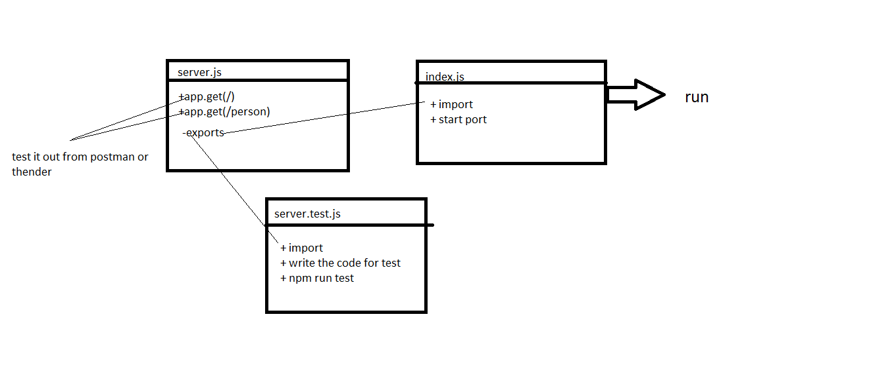

# basic-express-server


## Author: ahmad nofal
- [tests report](https://github.com/abu-nofal/basic-express-server/actions)
- [front-end]()
## Setup
`.env` requirements
- PORT - [8000]

`npm start`
- Endpoint: /person
- Returns Object

```
{
  "name":"name provided"
}
```
## Tests
- Unit Tests: npm run test
- Lint Tests: npm run lint
UML




## link for deploy 

- 